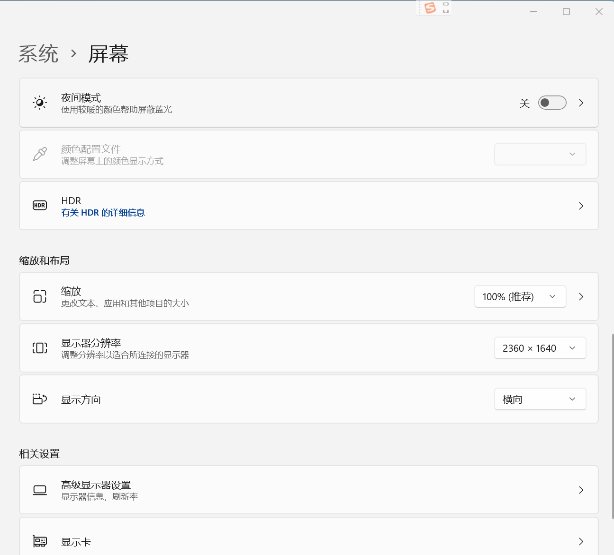

## 0 前期准备

- 安装 bilibili 直播姬：[哔哩哔哩直播姬下载 (bilibili.com)](https://link.bilibili.com/p/eden/download?#/web)
- 安装 obs 软件: [Open Broadcaster Software | OBS (obsproject.com)](https://obsproject.com/)
- 安装 bp 软件（通过联系主办方获得）

本文使用环境为：

- obs 30.1.2
- bilibili 直播姬 5.13.0.6976
- ZVLbp 软件 5.0 版

另外，由于 bp 软件在 Windows 下开发，很可能存在 linux 和 IOS 系统下不适配的问题，因此建议导播使用 Windows 系统，本文也默认采用 Windows 系统进行。

## 1 bp 软件使用

### 1.1 基本信息

bp软件后台大致如下：

导播应在 **每局比赛开始前** 确保求生者队伍、监管者队伍、全局禁选、场次、比分、选手ID准确无误。

**bp开始** 后，根据比赛模式中的bp结果更新本页面中选图，ban求生者/监管者，pick求生者/监管者部分。

点击 “生成bp界面” 按钮即可唤起前台，前台应在 **基本信息填写后，bp开始前** 唤起。前台信息会随着后台更新而 **实时更新**。

### 1.2 更新方式

ban/pick 求生者/监管者 可以通过输入角色 **职业名称** 或其首字母的方式检索角色（如幸运儿可以通过输入 xye 检索），选中后会出现对应的图片，此时前台也会对应更新。

其他板块直接打字即可。

### 1.3 使用实例

下面给出一个后台对应的前台样式，以供参考。

### 1.4 bp 软件更新

此任务应当由当届主办方与上一届主办方交流后完成，需要一定编程基础，此处暂略。

## 2 开播流程

### 2.0 前期准备

#### 2.0.1 环境配置

- 从主办方处获得配置 json 文件，此处示例为 `24.json`
- 选择上方的 `场景集合-导入`，然后点击`...`，找到场景集合 `24.json` 的位置并导入

- 选中文件，然后点击导入

- 此时可能会出现脱机提示，无视即可

- 然后你应该得到如下界面，此时场景一栏内有 6 个选项，后文中将一一介绍功能以及如何配置

- 打开 bilibili 直播姬，点击`更多-第三方推流`，获取推流地址和推流码

- 返回 obs，选择 `文件-设置-直播`，进入直播设置界面。在服务中选择 `自定义`，并且输入对应的服务器和推流码

- 此时返回 obs 主界面，点击 `开始直播`，即可看到 bilibili 直播姬也开始了直播。但在此之前应当先将场景全部配置完毕

#### 2.0.2 场景配置

（此处以正式比赛流程为例，对于规则不同的娱乐模式等其他比赛，应用类似方法自行设计场景）

图像文件导入的方式为 `选中来源-浏览-选择对应的图像文件路径`。

对应的图片素材都会在赛前给到导播，这一点还请放心。

##### 2.0.2.1 对战图

共三个图片素材，分别是 Team A（第一队的队伍海报）， Team B （第二队的队伍海报）， 封面（赛事封面，这里以 P5 联动预告信为例）。

其中 Team A， Team B 素材一开始设置为隐藏（即点掉眼睛图标），封面始终不隐藏。解说提到对应队伍时将对应队伍的海报取消隐藏。

##### 2.0.2.2 解说页

共一个图片素材，为解说页图片。始终不隐藏。

##### 2.0.2.3 噩梦逐影

共两个窗口一个图片素材。其中两个第五人格窗口 SMALL 和 BIG 分别对应正式对局中的大小窗口，亦分别对应导播的两个第五人格账号。

需要注意的是，由于开启了两个第五人格窗口，在窗口选择时会出现两个“第五人格.exe”选项，此时导播可能会发现无论选择哪个弹出的都是同一个窗口。

解决方式为，系统默认选中的窗口是 **上一个被选中的游戏画面**，即如果我们要选中小窗，那么我们就可以点击小窗对应的游戏画面，然后返回obs，此时选中的就会是小窗。

##### 2.0.2.4 bp

共一个窗口，即 bp 软件前台，选中即可。

##### 2.0.2.5 区域选择

共一个窗口，对应到正式对局中的 BIG 窗口即可。

**注：特别的这个场景还用于展示赛后数据。**

##### 2.0.2.6 正式对局

可以发现，这一场景中不仅有小窗口大窗口，还有大量文字：

首先，大窗口小窗口的设置见 **2.0.2.3 噩梦逐影** ，这里不再复述。

“图像5”（实际下发文件中可能会改变名称）对应的是正赛框图片，导入即可。

文字部分，左右小分和大分应当在对局结束后及时修改文字内容；FIRST HALF 与 SECOND HALF 以及 GAME \* 根据实际情况修改内容或者更改隐藏情况即可。

### 2.1 开播流程

开播前，导播应确保所有场景均不存在脱机情况。同时，导播应注意每一个窗口在被推送时应当在自己的显示器中 **完全显示**，否则可能出现窗口部分变成黑屏的情况。这一点建议导播在第一次开播前自行尝试效果以便理解。同时，建议导播关闭 **小窗口** 的所有游戏内声音。

**下面为详细流程：**

每天第一场比赛前10min开始：导播播放网易云音乐歌单【赛前】；同时投屏第一场比赛的两支队伍对抗图（即比赛封面）。

两位解说可以提前在群里开启群语音，导播按时加入语音，注意导播一旦进入声音就会被录入直播。

解说开始介绍两支战队时，导播根据解说的话依次投屏战队合照和战队介绍。念完后，导播切换画面回两支队伍对抗图。

**裁判** 作为自定义房间的房主开启自定义，确认4求生+1监管的位置都已经调整好，确认观战席2导播+2解说+1裁判（战队成员不允许进入观战席）。为了避免游戏声音混乱，建议 **裁判邀请小窗口对应的账号，小窗口对应的账号邀请大窗口对应的账号**。

清空上一场比赛的bp内容，将bp软件内的4求生+1监管的名字都打上去，将最上面一行的积分和胜负场数填写完成。

导播将bp画面投屏到直播间，提示裁判可以开始进入bp，同时播放歌单【bp音乐】（赛点局则播放【赛点局bp音乐】）。裁判在群内完成地图bp进入游戏画面。

导播根据游戏画面将bp结果同步到软件界面中，解说根据bp情况进行解说。

在比赛模式 60s 准备时间大约还剩下 5s~10s 时，解说念出“现在即将进入第X局上/下半场的比赛画面……”；导播将直播切换到正赛界面。

比赛结束后，导播 **切换到区域选择场景** ，点击左上角调出数据界面，解说（自己也点左上角）念本场比赛数据。

退出房间后，导播播放歌单【中场休息】，进入解说尬聊期，裁判重新创建自定义房间。

一整场比赛结束后，导播播放歌单【赛前】，同时投屏下面一场比赛的两支队伍对抗图。

## 3 其他

### 3.1 导播技巧

#### 3.1.1 声音推送原理

为了方便操作，直播时推送的声音即为系统声音，即自己计算机上播放的声音全部都会被推送出去。

而第五人格游戏窗口的音频逻辑时“选中才播放”。因此，正赛阶段应尽可能避免点击 **大窗口** 以外的窗口，切换小窗口对应的求生者时，应当快速切回大窗口避免声音出现明显断裂；非正赛阶段应尽可能避免点击 **大窗口** 导致出现多余的声音。

同时也建议关闭其他可能产生声音的窗口后再进行直播，比如微信和QQ。

#### 3.1.2 未完待续

如果还有什么值得注意的点我会写在这里。

### 3.2 扩展显示器

#### 3.2.0 概览

考虑到推流时窗口较多，同时第五人格窗口的分辨率取决于第五人格窗口的大小，因此我们建议导播使用多个显示器来解决这一问题。

考虑到用户不一定拥有多个显示器的实体环境，这里给出一种用 ipad 模拟额外显示器的方法供参考。至于安卓系统是否类似，笔者只能表示还没有尝试过，但是大致的原理应该是一致的。

#### 3.2.1 Spacedesk

首先在 iPad 设备和电脑上各自安装 Spacedesk 软件，iPad 在 app store 中安装即可，电脑上可从 [官网](https://spacedesk.net/) 安装。

在电脑端打开 Spacedesk DRIVER Console，出现以下界面：

考虑到读者自身设备可能的限制，笔者这里只介绍无线连接的方式，有线请自行探索。

对于无线连接，我们根据红圈内的 IP 地址，在 iPad 端对应的程序中输入该 ip 地址进行链接（点击右上角的加号）。

添加完成后会发现列表中出现了我们的电脑设备，点击即可：

此时就会自动连接，然后如果屏幕上出现主屏幕的复制或扩展就说明大概率成功了（如果是复制，可以在电脑端的屏幕设置中改变显示设置，这里不赘述）：

连接成功后，电脑端应该会出现下面的窗口提示：

此时 iPad 端分辨率较低，可以在个性化中设置扩展屏幕的分辨率，大致如图：

此时分辨率就够高了。

#### 3.2.2 扩展完成

扩展完成后，可以参考以下布局：

- 主屏幕全屏播放 **大窗口** 的内容，或留一小块给小窗口
- 扩展屏幕放置 bp 软件，bp 后台和 obs