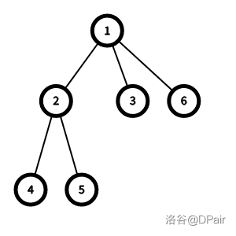

//20210206update：树上莫队中关于欧拉序的描述出现偏差，修锅。

//20201225update：更改了一些不必要的或错误的言论，感谢神仙lxl的指出。
# -2 前言

刚学完二次离线莫队，稍微整理一下莫队这个算法。

本人版权意识薄弱。。。

# -1 前置知识

- 多关键字排序

- 循环

- \*LCA（最近公共祖先），这个应该就树上莫队会用到

- 可能需要一些基础分块思想

没错如果这些都会了那你就可以愉快的学习莫队了。

注：本文无特殊说明默认 $n,m$ 同阶，其他的请自行具体情况具体分析。

注2：本文不考虑在线化莫队，并认为那是一种分块

# 0 暴力

## 0-1 算法简介

在开始之前，我们先学习一种叫 “暴力” 的~~优秀算法~~。

暴力，顾名思义就是题目让你做什么你就做什么，不加任何优化也不做过多思考。

比如这样一道题。

## 0-2 例题分析

### 例1：
[P2709 小B的询问](https://www.luogu.com.cn/problem/P2709)

#### 【题意简述】
给你一个长度为 $n$ 的序列 $a$ ，$a[i] \in [1,k]$，有 $m$ 次询问，每一次询问一个区间 $[l,r]$ 中 $\sum\_{i=1}^k c\_i^2$ 的值， $c\_i$ 表示 $i$ 在 $[l,r]$ 中的出现次数。

#### 【思路】
考虑暴力枚举，每一次暴力扫一遍整个区间，对于遇到的每一个 $a\_i$ ，我们使得 $c\_{a\_i} \gets c\_{a\_i}+1$ ，最后暴力求出 $\sum\_{i=1}^k c\_i^2$ 即可。

复杂度 $O(m(n+k))$ 。~~非常优秀~~

显然过不去。

我们考虑怎么优化这个算法。

不难发现，我们执行 $c\_{a\_i}\gets c\_{a\_i}+1$ 操作时，我们已经可以考虑最终答案会怎么变化，不难发现当 $c\_{a\_i}\gets c\_{a\_i}+1$ 时，答案会增加 $2c\_{a\_i}+1$ （这里的 $ c\_{a\_i}$ 是未变化前的）。

因此我们每一次 $c\_{a\_i}\gets c\_{a\_i}+1$ 时可以直接更新答案，复杂度现在与 $k$ 无关了，为 $O(nm)$ 。

然后我们不难发现我们经常会算重一些区间，比如 $[1,10]$ 和 $[2,11]$ 的差距其实是不大的。

那么我们考虑算完 $[1,10]$ 之后，算 $[2,11]$ 时把 $a\_1$ 的贡献去掉 $a\_{11}$ 的贡献加上，就是 $[2,11]$ 的答案了，我们可以把这个操作看成移动区间的端点。

那么怎么减去贡献呢？

其实和加是差不多的。

和 $c\_{a\_i}\gets c\_{a\_i}+1$ 类似， $c\_{a\_i}\gets c\_{a\_i}-1$ 时我们只需要考虑答案会减少多少，不难发现减少的也是 $2c\_{a\_i}+1$ （然而这里 $ c\_{a\_i}$ 是变化后的），然后我们就可以通过上一个询问更新出下一个询问的答案了，具体这么实现：

```cpp
while(l > q[i].l) add(a[-- l]);
while(r < q[i].r) add(a[++ r]);
while(l < q[i].l) del(a[l ++]);
while(r > q[i].r) del(a[r --]);
```

其中 `add(x)` 表示加入一个 `x` 并计算贡献，对应的， `del(x)` 表示删去一个 `x` 并计算贡献。

但是复杂度仍然没有变化，因为上面所说的这个算法是可以被卡到 $O(nm)$ 的。

那么我们就想一想这个算法怎么才能不被卡。

于是莫队算法应运而生。

# 1 普通莫队

## 1-1 算法简介

下面我们简单介绍一下莫队算法。

其核心思维就是对于 **区间查询** 操作，通过对所有 “被询问的区间进行” **合理的排序** ，然后通过 **暴力移动区间的左右端点** 并 **快速更新答案** 得到所有询问的结果。

是不是挺绕的？我们来看一道例题。

## 1-2 例题分析

### 例1：
[P2709 小B的询问](https://www.luogu.com.cn/problem/P2709)

~~没错我又回来了~~

#### 【题意简述】
给你一个长度为 $n$ 的序列 $a$ ，$a[i] \in [1,k]$，有 $m$ 次询问，每一次询问一个区间 $[l,r]$ 中 $\sum\_{i=1}^k c\_i^2$ 的值， $c\_i$ 表示 $i$ 在 $[l,r]$ 中的出现次数。

#### 【思路】
刚才我们已经学会了这道题暴力怎么做，并且我们也明白了怎么暴力移动区间端点。

那么怎样我们才能使得复杂度正确呢？

首先，我们把这个序列分成很多长度相同的块，每一块长度设为 $b$ 。

然后对于所有 **左端点在同一个块里的询问** ，我们按它们的 **右端点升序排序** ， 否则我们按它们的 **左端点升序排序** ，具体为什么这么写一会儿会讲。

这部分代码如下：（其中 `idb(x)` 表示 `x` 在第几个块里）

```cpp
inline int idb(int x){return x / b;}
struct QUEST{//表示一个询问
    int l, r;
    int id;//表示这个询问是第几个，由于询问在排序后顺序会乱掉，我们要存储其原先的询问顺序。
    inline bool operator <(const QUEST &tmp) const{
        return (idb(l) != idb(tmp.l)) ? l < tmp.l : r < tmp.r;
    }
}q[50005];
```

接下来我们来分析一下为什么这样子会跑的很快。

首先我们知道我们移动左右端点复杂度是 $O(1)$ 。

首先我们对于每一个块，由于所有左端点在一起的询问被排序到了一起，那么这一部分左端点做多移动 $b$ 次，**一次询问** 复杂度是 $O(b)$ 的，由于我们有 $m$ 个询问所以 **总体** 复杂度是 $O(mb)$ 的。

然后考虑右端点，由于右端点单调递增，所以只会往右移动，那么最多移动 $n$ 次，由于有 $n \over b$ 个块，所以 **总体** 复杂度是 $O({n^2 \over b})$ 的。

那么最终整道题的复杂度是 $O(mb+{n^2 \over b})$ 的。

但是， $b$ 的值其实是我们自己来确定的。

显然当 $mb={n^2\over b}$ 时，这道题拥有最优的复杂度。

那么我们就得到了 $b^2={n^2 \over m}$ ，显然 $b=\sqrt{{n^2 \over m}}$

由于 $n, m$ 同阶（通俗来讲就是数据范围一样），我们假设 $n=m$ ，那么 $b=\sqrt{n}$ 时复杂度最优。

最终复杂度就变成了 $O(n\sqrt{n})$ 远远优于刚才的复杂度。

## 1-3 算法流程

不难发现我在用莫队解刚才那一道题目的时候与原题似乎没有任何关系。

可见这其实就是莫队的一个通法。

算法大概遵循一个这样的流程：

1. 对于所有区间端点的移动，我们要设计出一种 $O(1)$ 的方法使得我们可以快速维护移动端点后一个区间的答案。
2. 有了这种方法之后，我们根据刚才的复杂度分析，我们对整个序列分块，每一块大小 $O(\sqrt{n})$ 。
3. 然后我们对所有询问的区间排序，排序完之后左端点每一次最多移动 $\sqrt{n}$ 的距离总共 $n$ 次，右端点单调不降所以每一个块移动 $n$ 的距离总共 $\sqrt{n}$ 次，所以总复杂度为 $O(n\sqrt{n})$ 。

最后全部输出即可。

## 1-4 算法优化

其实可以加一个小小的优化。

不难发现，排序的时候，我们每一个块都是按右端点升序排序的，这里显然只需要保证右端点单调就行了，所以降序排序也是对的。

然后我们又不难发现，每一次我们处理完左端点在某一个块中的所有询问后，右端点此时应该在序列的靠右端，处理下一个块时又回到最左端了，然后又不断往右，有一些浪费。

所以我们考虑引入“奇偶块排序”，即对于左端点编号为奇数的块升序，左端点编号为偶数的块降序排序。

于是实现变成了这样：

```cpp
inline int idb(int x){return x / b;}
struct QUEST{
    int l, r;
    int id;
    inline bool operator <(const QUEST &tmp) const{
        return (idb(l) ^ idb(tmp.l)) ?(l < tmp.l) : ((idb(l) & 1)? r < tmp.r : r > tmp.r);//注意这里的排序发生了一些变化
    }
}q[50005];
```

是一个优化，但并不能降低算法复杂度。

## 1-5 算法优劣

### 优势

1. 复杂度优秀，可以处理不少区间询问的问题
2. 实现简单，思维难度小，不容易出错

### 劣势

1. 只能离线，无法处理强制在线的问题

2. 复杂度是 $O(n\sqrt{n})$ 而不是 $O(n\log n)$ ，有时数据范围较大则无法处理后者能处理的问题

## 1-6 推荐习题

1. [SP3267 DQUERY - D-query](https://www.luogu.com.cn/problem/SP3267)

莫队的经典运用之一：区间数颜色

2. [CF617E XOR and Favorite Number](https://www.luogu.com.cn/problem/CF617E)

很套路但有一定思维难度的莫队

3. [P3709 大爷的字符串题](https://www.luogu.com.cn/problem/P3709)

莫队的应用，需要离散化

# 2 带修莫队

没想到吧，这东西还可以带修。

## 2-1 算法简介

一般带修莫队支持的都是单点修改，我们这里也认为只支持单点修改。

带修莫队就是在莫队的基础上加上一维 “时间” ，然后同样对这一维度进行排序。

干说似乎不太行，还是引入一道例题。

## 2-2 例题分析

### 例2：

[P1903 [国家集训队]数颜色 / 维护队列](https://www.luogu.com.cn/problem/P1903)

#### 【题意简述】

给你一个长度为 $n$ 的序列 $a$ ，$a[i] \in [1,k]$，有 $m$ 次询问或修改，每一次询问一个区间 $[l,r]$ 中出现过多少不同的数，每一次单点修改一个数。

#### 【思路】

如果没有修改的话，一般的莫队其实就是看端点上的数在修改后出现状态会不会发生变化，显然 “有” -> “无” 会使得答案 $-1$ ，“无” -> “有” 会使得答案 $+1$ 。

那么。。。加上修改呢？

我们考虑对于每一次询问记录一个时间戳 $t$ ，表示这个询问之前进行了 $t$ 次修改，那么由于修改顺序是不会变的，进行过哪些修改一目了然。

此时，我们在原先排序的基础上，对于所有 **右端点** 在同一个块中的询问按 $t$ 升序排序。

然后从一个区间 $([l,r],t)$ 推到 $([l',r'],t')$ 时，我们考虑把 $[l,r] \rightarrow [l',r']$ 的过程先解决，然后再推 $t\rightarrow t'$ ，由于我们都是单点修改，我们只需要看 $t$ 所修改的位置是否在当前区间内，如果在，则删去原有信息，加入新信息，然后直接对位置上的数进行修改即可。

可以这么实现：

其中 `c[x]` 为一个 `std::pair<int, int>` 类型的变量，`c[x].first` 表示修改的位置， `c[x].second` 表示修改的值。

```cpp
    while(t < q[i].t){
        int tmp = a[c[++ t].first];
        a[c[t].first] = c[t].second;
        if(c[t].first >= q[i].l && c[t].first <= q[i].r) add(a[c[t].first]);
        c[t].second = tmp;//仔细想一想为什么要交换，我不多赘述
        if(c[t].first >= q[i].l && c[t].first <= q[i].r) del(c[t].second);     
    }
    while(t > q[i].t){
        int tmp = a[c[t].first];
        a[c[t].first] = c[t].second;
        if(c[t].first >= q[i].l && c[t].first <= q[i].r) add(a[c[t].first]);
        c[t].second = tmp;//同上
        if(c[t].first >= q[i].l && c[t].first <= q[i].r) del(c[t].second);
        t --;
     }
```

没错，改这么一点就可以支持修改了。

我们来分析一下复杂度。

首先还是假设块长为 $b$ 。

然后，我们显然有 $({n\over b})^2$ 个 **左端点块和右端点块形成的数对** ，每一个这样的数对中 $t$ 单调递增，需要修改 $n$ 次。

然后这里面每一次左右端点的修改都是 $b$ 次，总共有 $n$ 组。

故总复杂度为 $O(n({n\over b})^2+bn)$ 。

显然我们要使得 $n({n\over b})^2=bn$ 。

得到 $n^2=b^3$ ，所以 $b=n^{2 \over 3}$ 时最优，那么总复杂度为 $O(n^{5 \over 3})$ 。

但至少比暴力修改要好。

## 2-3 算法流程

其实和普通莫队差不多。

1. 设计出这道题不带修怎么莫队。
2. 把时间戳 $t$ 加入到排序中，然后在处理询问时移动 $t$ 指针，采用一个加一个删来等效替代修改操作。

然后。。。其实就好了

## 2-4 算法优劣

### 优势：

1. 可以支持修改，莫队又变强了。

### 劣势：

1. 复杂度较高，无法应对大数据范围
2. 似乎只能支持单点修改

## 2-5 推荐习题

1. [CF940F Machine Learning](https://www.luogu.com.cn/problem/CF940F)

带修莫队应用

# 3 树上莫队

没想到吧，这东西还可以上树

## 3-1 算法简介

众所周知，树上的一些数据结构问题都是把树上的问题压到一个序列上进行求解。

莫队也不例外，可以处理树上的问题。

但我们可能需要引入一些奇奇怪怪的东西。。。

## 3-2 括号序

我们引入一棵树的括号序，这也是一种 dfs 序，对于一棵节点数为 $n$ 的树，它的括号序为一个长度为 $2n$ 的序列，记录了对这棵树 $dfs$ 时一个点 “入搜索栈的时间戳” 与 “出搜索栈的时间戳” 。

比如对于这样一棵树：



它的括号序就是 $\{1,2,4,4,5,5,2,3,3,6,6,1\}$ （可能不只一种）

同时我们对于每一个值记录两个下标，这里我们设 $dfn[x]$ 表示 $x$ 这个数在序列中第一次出现的位置， $low[x]$ 表示最后一次出现的位置。

这东西用处很多，这里只讲它在树上莫队中的用处。

## 3-3 例题引入

### 例3：

[SP10707 COT2 - Count on a tree II](https://www.luogu.com.cn/problem/SP10707)

#### 【题意简述】

给你一棵 $n$ 个节点的树，每一个点有一个颜色，每一次询问一条路径上的节点的不同颜色数。

#### 【思路】

首先，我们已经学会了怎么在一个序列上处理这个问题。

现在我们考虑怎么让莫队上树。

先拿刚才那一棵树来说吧。

这需要分类讨论：（假设我们询问的是 $(u,v)$）

##### 1、$u$ 在 $v$ 的子树中：

比如 $v=2, u=5$ ，我们考虑截取区间 $[dfn[v],dfn[u]]$ 即 $[dfn[2],dfn[5]]$ 。

这一段区间是 $\{2,4,4,5\}$ 。

其中 $4$ 出现了 $2$ 次，这是因为 $4$ 不属于这条路径，它已经进了一次搜索栈然后又出去了，这启示我们在莫队的时候要对出现两次的数进行去重，使得其没有贡献，这个我们在它出现过时 $del()$ ，未出现时 $add()$ 即可。

由于 $u$ 在 $v$ 的子树中，所以所有出现过两次的必然已经进过搜索栈又出了搜索栈，不在这条路径上，而剩下的只出现一次的点仍在搜索栈中，故在路径上。

##### 2、$u,v$ 没有祖孙关系

刚才的结论有一个前提，就是 $u$ 在 $v$ 的子树中，那么对于 $u,v$ 没有祖孙关系的呢？

我们同样可以这么取 $[low[v],dfn[u]]$，而此时我们需要保证的是 $low[v] < dfn[u]$ 。

为什么这是对的呢？

可以这么考虑：对于 $v$ 到 $lca(u,v)$ （这里指 $u, v$ 的最近公共祖先），我们不考虑其入搜索栈过程而只考虑其出搜索栈过程，那么只有 $v$ 到 $lca(u,v)$ 路径上的点是只出不进的，同样也只统计了一次，然后 $lca(u,v)$ 到 $u$ 的路径按第一种情况考虑即可。

然后我们发现这个区间中没有 $lca(u,v)$ ，所以这种情况中我们把它加上就是了。

那么这道题就做完了。

排序照常排，然后把 $add()$ 和 $del()$ 换成 “更改”，因为我们是要考虑一个点是否恰好出现一次才给它贡献。

然后数组长度是 $2n$ 不要忘了。

## 3-4 算法流程

其实也说得很清楚了。

1. 建出这棵树的括号序并处理出 $lca$ 。
2. 按普通莫队去跑，分类讨论子树关系，然后特判 $lca$ 的情况。
3. 修改时注意不一定是加点或者删点，而要根据这个点的出现次数判断是加点还是删点。

## 3-5 算法优劣

### 优势：

莫队可以上树了，莫队又变强了

### 劣势：

暂时想不到

# 4 回滚莫队（不删除/不增加莫队）

没想到吧，这东西还可以只增不删或者只删不增。

## 4-1 算法简介

顾名思义，这个莫队支持只增不删或者只删不增。

适用于那些 “增加和删除中有一个复杂度很大另一个复杂度很小” 的情况。

其实这就是普通莫队加一点点小改动而已，如果理解了普通莫队的本质那么回滚莫队其实很好懂。

## 4-2 算法流程

这里我们先讲流程。

回滚莫队分两类，只删不增和只增不删，我们先说前者。

### 1、只删不增回滚莫队

流程大致如下：

1. 先按原来的莫队排序方法进行排序，但是不能使用奇偶块排序的优化，我们要求 $r$ 单调递减。
2. 对于每一个左端点所在的块 $x$ ，我们设 $fst[x]$ 表示这个块的第一个节点，那么我们初始设一个区间 $[fst[x],n]$ ，这是一个大区间。
3. 对于 $[l,r]$ 在同一个块内的，我们可以暴力处理。
4. 对于 $[l,r]$ 不在同一个块里的，我们先移动右端点指针 $r$ ，由于 $r$ **单调递减** 所以我们只用删除。
5. 记录此时的答案 $tmp$ ，防止到时候回溯 $l$ 节点时需要增加。
6. 然后再移动 $l$ 指针 ，同理我们只用删除。
7. 最后恢复 $l$ 指针，利用先前留下的 $tmp$ 。

### 2、只增不删回滚莫队

流程大致如下：

1. 先按原来的莫队排序方法进行排序，但是不能使用奇偶块排序的优化，我们要求 $r$ **单调递增**。
2. 对于每一个左端点所在的块 $x$ ，我们设 $lst[x]$ 表示这个块的最后一个节点，那么我们初始设一个区间 $[lst[x],lst[x]-1]$ ，这是一个空区间。
3. 对于 $[l,r]$ 在同一个块内的，我们可以暴力处理。
4. 对于 $[l,r]$ 不在同一个块里的，我们先移动右端点指针 $r$ ，由于 $r$ 单调递增所以我们只用增加。
5. 记录此时的答案 $tmp$ ，防止到时候回溯 $l$ 节点时需要删除。
6. 然后再移动 $l$ 指针 ，同理我们只用增加。
7. 最后恢复 $l$ 指针，利用先前留下的 $tmp$ 。

是不是和普通莫队很像？

区别主要在于：

1. 每一个块分开处理，且使用不同的初始区间
2. $r$ 排序方向特定

然后你就学会了回滚莫队

它的复杂度显然是对的，因为每一次左端点最多还是移动 $O(\sqrt{n})$ 总共 $n$ 次，右端点还是 $O(n)$ 总共 $\sqrt{n}$ 次，总体复杂度还是 $O(n\sqrt{n})$ ，复杂度并没有下降，只是可能会增加常数。

## 4-3 例题引入

这里只举只删不增的例子

### 例4：

[P4137 Rmq Problem / mex](https://www.luogu.com.cn/problem/P4137)

#### 【题意简述】

有一个长度为 $n$ 的序列 $a$。

$m$ 次询问，每次询问一个区间内最小没有出现过的自然数。

#### 【思路】

我们先考虑普通莫队怎么做。

删除操作可显然了，我们删掉一个数之后看看它的出现次数是不是 $0$ ，如果是，再和当前答案去个最小值就行了。

那么增加操作呢？

似乎很难搞，怎么搞复杂度似乎都是不对的。

于是回滚莫队就有其用武之地了。

后面其实不用多说，按照刚才回滚莫队的板子去套就行了。

## 4-4 推荐习题

1. [AT1219 歴史の研究](https://www.luogu.com.cn/problem/AT1219)

不少人心目中的回滚莫队模板

2. [P5906 【模板】回滚莫队&不删除莫队](https://www.luogu.com.cn/problem/P5906)

洛谷钦定的回滚莫队模板

3. [SP20644 ZQUERY - Zero Query](https://www.luogu.com.cn/problem/SP20644)

回滚莫队的应用

# 5 二次离线莫队

没想到吧，这东西还可以再离线。

## 5-1 算法简介

大毒瘤 lxl 发明的算法，很强（双重含义）。

二次离线莫队一般会被用于解决这样的问题：

1. 可以莫队（废话）

2. 莫队移动端点的修改复杂度比较大（比如 log）

这时，我们就会考虑把莫队移动的这些端点也都离线下来预处理，从而进一步优化。

估计因此叫做二次离线。

## 5-2 算法流程

目前理解下来流程大概这样：

1. 先跑莫队，由于是二元组形式，我们考虑把每一个点的贡献拆分成 **这个点与这个点上一个点的前缀的贡献** 减去 **这个点与一段确定前缀** 的贡献。

2. 弄出一种数据结构，可以 $O(1)$ （或有些情况下稍劣） 查出一个点集与一个点之间的贡献，并可以 $O(\sqrt{n})$ （或有些情况下稍劣） 修改点集内的信息。

3. 那么我们先一遍扫预处理出 **这个点与这个点上一个点的前缀的贡献** 这一部分的贡献，显然是 $O(n\sqrt{n})$ 的。

4. 我们再在莫队的时候把所有需要求出的 **这个点与一段确定前缀** 所对应的 **询问点** 记录下来，由于这些点由第一次莫队处理出来所以点数为 $O(n\sqrt{n})$ 级别，我们可以选择用 `std::vector` 或其他工具把这些询问存储到对应 **产生贡献** 的前缀上去。

5. 最后由于每一个前缀都要修改一次，总共有 $n$ 个前缀每一次修改 $O(\sqrt{n})$， 所以这一部分 $O(n\sqrt{n})$ ，然后处理出的 **询问点** 的个数也是 $O(n\sqrt{n})$ ，我们又是 $O(1)$ 询问，我们就达到了总体复杂度 $O(n\sqrt{n})$ 。

## 5-2.5 算法优化

不难发现，在上面的二次离线过程中，我们存储的是一些 **询问点** ，但其实莫队处理出的询问点还有一个优美的性质，那就是每一次处理出的点显然都是连续的，故在 **产生贡献的前缀** 处，我们考虑把存储 **单点** 改为存储 **区间** ，这样一来总点数不变，但由于区间个数为 $O(n)$ 级别，而这里存点的过程又是原先的空间复杂度瓶颈，所以我们可以通过这个操作把空间减掉一个 $O(\sqrt{n})$ ，从 $O(n\sqrt{n})$ 变为 $O(n)$ 。而且在某一些题目中，若我们可以做到 $O(1)$ 修改（比如预处理），并且这个修改可以通过 $O(1)$ 区间查询的方式进行询问，那么扫完全局的复杂度甚至是 $O(n)$ 的。

这么干说似乎不太行，举一些栗子吧：

## 5-3 例题分析

### 例5：

[P5047 [Ynoi2019模拟赛]Yuno loves sqrt technology II](https://www.luogu.com.cn/problem/P5047)

#### 【题意简述】

给你一个长为 $n$ 的序列 $a$，$m$ 次询问，每次查询一个区间的逆序对数。

#### 【思路】

显然一种很 naive 的写法是用树状数组加一个莫队去维护这个东西，然后你就得到了一个 $O(n\sqrt{n} \log n)$ 的优秀暴力。

然后你必然会 $\text{TLE}$ 。

那么我们考虑怎么给它二次离线。

比如我们要向右移动一个区间 $[l,r]$ 的右端点直到 $[l,r']$ 。

一般来说，我们是不断地去 $add(++r)$ ，然而这里 $add$ 复杂度比较大会很不优秀。

我们考虑把这一堆 $add$ 全部存下来。

不难发现，每一个 $r$ 经过的位置（记为 "$R$"）产生的贡献为 $[l,R-1],R$ 产生的逆序对个数。

我们差分一下，就变成了 $[1,R-1],R$ 的逆序对个数减去 $[1,l-1], R$的逆序对个数 

显然前面那一项直接树状数组跑一遍就行了。

后面的，我们考虑全部离线下来，把这些 $R$ 全部扔到对应的 $l-1$ 里面。

由于这些 $R$ 是连续的，我们直接扔一段 $[r + 1, r']$ 的区间就行了。

那么我们再考虑怎么预处理这一块。

树状数组？显然不行。

我们不难发现由于我们这些点都是用莫队离线出来的，点数是 $O(n\sqrt{n})$ 级别的。

而我们每一个 $l$ 只需要修改一次，总共是 $O(n)$ 的。

于是我们需要一个 $O(\sqrt{n})$ 修改， $O(1)$ 查询前缀和的东西，这个值域分块可以搞定。

其他三种移动应该以此类推就行了。

分析一下复杂度：

还是用刚才的例子，瓶颈显然在于 $[1,l-1],R$ 的处理上，然后第二次离线时我们修改是 $O(n\sqrt{n})$ 的，查询是 $O(n\sqrt{n})$ 的。

再看空间，显然每一次只会多出来 $O(1)$ 级别的连续段个数，然后值域分块也是 $O(n)$ 的，所以总空间复杂度 $O(n)$。

十分优秀，真的十分优秀。

### 例6：

[P4887 【模板】莫队二次离线（第十四分块(前体)）](https://www.luogu.com.cn/problem/P4887)

#### 【题意简述】

给你一个长度为 $n$ 的序列 $a$，每次查询给一个区间 $[l,r]$ 。

查询 $l \leq i< j \leq r$ ,且 $a\_i \oplus a\_j$ 的二进制表示下有 $k$ 个 $1$ 的二元组 $(i,j)$ 的个数。$\oplus$ 是指按位异或。

#### 【思路】

同样考虑怎么二次离线

首先我们知道 $k$ 是固定的。

然后发现值域很小，为 $2^{17}$ 的样子（后文的 $17$ 就是这么来的）。 

然后一般的莫队思路有两种，一种是 $O(C(17,k))$ 修改然后 $O(1)$ 查询，一种是 $O(C(17,k))$ 查询 $O(1)$ 修改，两种思路其实就都是直接枚举“所有与这个数异或后的数二进制下有 $k$ 个 $1$ 的数”，这一部分显然可以通过枚举 “所有二进制下有 $k$ 个 $1$ 的数” 然后异或上当前数得到。

为了二次离线，我们考虑选择前一种修改复杂度大的。

那么还是询问拆成两部分。

还是拿我们要向右移动一个区间 $[l,r]$ 的右端点直到 $[l,r']$ 来举例子。

不难发现，每一个 $r$ 经过的位置（记为 "$R$"）产生的贡献为 $[l,R-1],R$ 产生的符合条件的数的个数。

同样差分一下，就变成了 $[1,R-1],R$ 的数对个数减去 $[1,l-1], R$的数对个数 

前面那一项 $O(C(17,k))$ 修改 $O(1)$ 询问就能结束，总共 $n$ 次所以复杂度是 $O(C(17,k)n)$。

后面的，我们同样考虑全部离线下来，把这些 $R$ 全部扔到对应的 $l-1$ 里面。

由于这些 $R$ 是连续的，我们直接扔一段 $[r + 1, r']$ 的区间就行了。

然后还是 $O(C(17,k))$ 修改 $O(1)$ 询问，这部分复杂度是 $O(C(17,k)n+n\sqrt{n})$ 。

于是总复杂度变成了 $O(C(17,k)n+n\sqrt{n})$ 。

其实蛮套路的。

## 5-4 算法总结

总体考虑下来，这个东西复杂度如此优秀的原因可能主要还是在于节省了修改时间，让修改次数变为了 $O(n)$ ，并同时也让空间复杂度变为了 $O(n)$ ，从而解决了询问修改都为 $O(n\sqrt{n})$ 次的普通莫队算法在修改方面的劣势，如果能设计出优秀的数据结构，可以使得总体复杂度下降为 $O(n\sqrt{n})$ 。

## 5-5 推荐习题

1. [P5501 [LnOI2019]来者不拒，去者不追](https://www.luogu.com.cn/problem/P5501)

二次离线莫队简单题

2. [P5398 [Ynoi2018]GOSICK](https://www.luogu.com.cn/problem/P5398)

第十四分块
