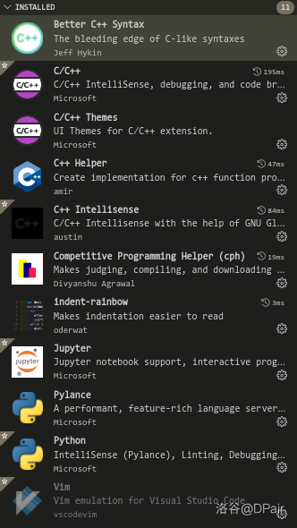

早上打比赛，被 Windows 阴间到了，准备这周回家装一个 ubuntu / NOI linux 2.0，怕和上次一样换位置搞配置搞半天，因此写一篇博客方便进行配置

主要是我记性太差，每一次发现有问题了又要改改改，挺浪费时间的（最典型就是上次配置完之后打比赛调题，调到最后发现是脚本挂了）

## 一、系统配置

1、 系统语言

直接改成英文，不然终端里面挺难操作的

改完之后中文可能会显示为日文，比如 “门” 这种字

可以直接 bdfs

2、 应用程序

+ `noilinux@dpair:~$ sudo apt install xfce4-terminal` 下载个人常用的 `Xfce4` 终端
+ VS Code
+ Google Chrome
+ Typora
+ pinta
+ vim 是自带的
+ fcitx + 搜狗拼音，前者直接 `sudo apt install fcitx` 然后其他啥都不干，后者上官网，要重启，要在设置里改一些东西
+ 下载 `nodejs` 方便搞博客

3、 快捷键

+ `Launch terminal` 改成一组你不可能按的键，因为常用的终端还是 `Xfce-Terminal`
+ `Launch web browser` 改成 `Ctrl+Alt+E`
+ `Settings` 改成 `Ctrl+Alt+S`
+ 换工作区那几个快捷键感觉用处其实不是很大，最常用的还是 `Ctrl+Alt+up/down`
+ `Switch windows directly` 改成 `Ctrl+Alt+Super+backslash` （也就是 `\` 键），方便同工作区切窗口
+ `Raise window is covered, otherwise lower it` 改成 `Ctrl+Alt+Super+L` 作用同上

4、 自定义快捷键（前半部分是快捷键，后半部分是对应的命令）

+ `Screenshot` ：`Ctrl+Alt+A`， `gnome-screenshot -a` ，截取部分屏幕
+ `Launch gedit` ： `Ctrl+Alt+G` ， `gedit` 
+ `Launch xfce-Terminal` ： `Ctrl+Alt+T` ， `xfce4-terminal`
+ `Launch typora` ： `Ctrl+Alt+M` ， `typora`
+ `Launch VS code` ： `Ctrl+Alt+C` ， `code`
+ `Launch calc` ： `Ctrl+Alt+Q` ， `gnome-calculator`
+ pinta 还是直接 `Super` 打开吧（（

## 二. VS code

1、 插件配置

目前的配置如图：

其中前 5 个 `C++` 是系统推荐的，就装了，也不知道有什么用

第 6 个 `cph` 是下载样例用的（如果不能翻墙那么这个插件也没什么用，要配合 `Competive Companion` 这个浏览器插件）

第 7 个是方便查缩进的

后面的好像都是系统自带的

2、 快捷键配置

修改这么几个快捷键就行了：

+ `Toggle Terminal` 改成 `"ctrl+shift+/"`
+ `Toggle Output` 改成 `"ctrl+shift+o"`

这两个是为了配合 `cph` 插件的

3、 首选项

+ `Auto Save` 改成 `onFocusChange` ，这个自动保存应该是最方便的一个
+ `Font Family` 改成 ` 'monospace', monospace, 'consoles'`
+ `Font size` 看喜好
+ `Theme` 全部改成 `Monokai` ，似乎很好看，反正现在在用
+ `Minimap` 在设置里 `Disable` 掉，剩下的直接在外面就可以右键然后 `Disable`
+ 终端那一块不需要 `Debug Console` ，关掉

4、 Snippets

[见此](https://www.luogu.com.cn/paste/ygkduhdq)

## 三、 Chrome

这个装不了可以用 `chromium` 代替

1、 插件（可能都要翻墙所以装不了）

+ `extend luogu` ，这个真的是大大提升了洛谷的可用性，建议直接 [github上下载](https://github.com/extend-luogu/extend-luogu)
+ `Competive Companion` ，算法竞赛助手，下载样例用的
+ `Dark Reader` ，护眼用的，光线暗的时候效果不错，也不需要特别去配置
+ `Block Site` ，可以 `ban` 网站，比如洛谷题解（实测有效）
+ `Tampermonkey` ，用来搞 `extend luogu` 的
+ `CF-Perdictor` ，预测 `CF rating` 涨落 

2、 把搜索框配成百度搜索，可以在设置里面找到

## 四、其他插件

下一个 `cf` 插件就够了，见这里：[github 链接](https://github.com/xalanq/cf-tool)

## 五、文件夹建立

全部直接建在 `~/` 下，缩短路径长度

要建的有 `templates` （如果自带就不用建了），一个拿来平时写代码的文件夹，一个拿来存 `cf` 插件文件的文件夹，一个拿来存 `cph` 插件的文件的文件夹，还有一个存对拍器的文件夹，总共 5 个

## 六、其他脚本

自己写的 shell ，屑的跟个什么一样（（

全部要放在 `~/.local/bin/` 下面

太丢人了不公开了

[见此](https://www.luogu.com.cn/paste/00r6zdgb)

